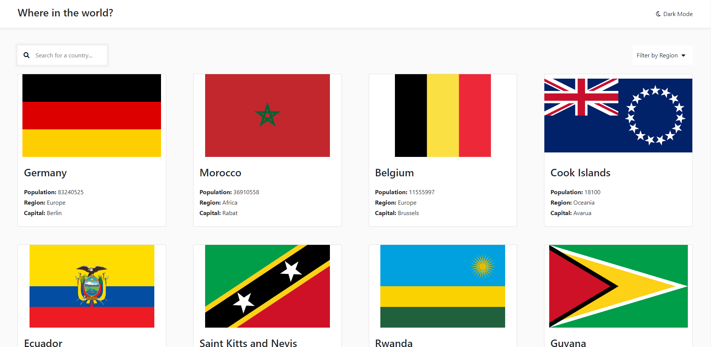

# REST Countries

This is a solution to the [REST Countries API with color theme switcher challenge on Frontend Mentor](https://www.frontendmentor.io/challenges/rest-countries-api-with-color-theme-switcher-5cacc469fec04111f7b848ca). This is also the tutorial for the Summer Camp Course that I teach on [Schoolhouse.world](https://schoolhouse.world/series/1803?ref=u-z1aylccz1vjxlx).

## Table of Contents

- [Overview](#overview)
  - [The challenge](#the-challenge)
  - [Screenshot](#screenshot)
  - [Links](#links)
- [Built with](#built-with)
- [Setup](#setup)

## Overview

### The challenge

Users should be able to:

- See all countries from the API on the homepage
- Search for a country using an `input` field
- Filter countries by region
- Click on a country to see more detailed information on a separate page
- Toggle the color scheme between light and dark mode

### Screenshot



### Links

- Live Site URL: [Countries](https://countries-cybercoder-naj.vercel.app/)

## Built with

- Nuxt.js v3.0.0-rc03
- Bootstrap

## Setup

Clone the repository using the `git clone` command:

```bash
git clone https://github.com/cybercoder-naj/countries.git
```

Make sure to install the dependencies:

```bash
# yarn
yarn install

# npm
npm install

# pnpm
pnpm install --shamefully-hoist
```

## Development Server

Start the development server on http://localhost:3000

```bash
npm run dev
```

## Author

- Website - [Nishant Aanjaney Jalan](https://cybercoder-naj.github.io)
